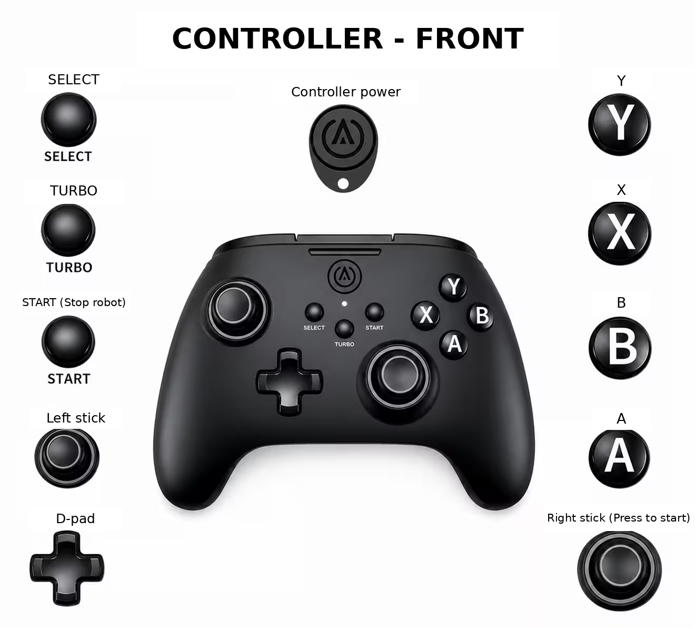
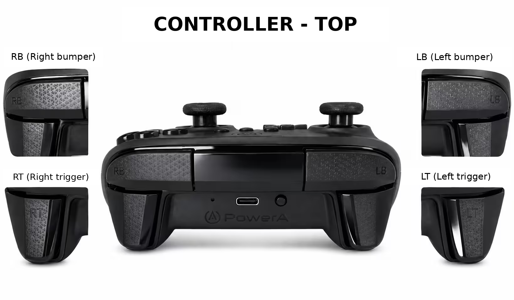

# bxi_robot_test

ELF3 hardware tests for NVIDIA Jetson running Ubuntu 24.04 and ROS 2 Jazzy.
The unified controller provides PD holding, automatic and joystick walking,
arm/leg range-of-motion tests, and arm load motions.

- [Requirements](#requirements)
- [Deployment](#deployment)
- [Operation and buttons](#operation-and-buttons)

## Requirements

- NVIDIA Jetson (`aarch64`), Ubuntu 24.04, and ROS 2 Jazzy already installed.
- Matching ARM64/Jazzy hardware packages at `/opt/bxi/bxi_ros2_pkg`, including
  `hardware_elf3` and `communication`.
- Sudo access and Internet access when dependencies need installation. NumPy and
  ONNX Runtime are checked/installed by `deploy.sh`. MuJoCo is only needed for
  simulation/collision tooling.
- Connected IMU and serial power board, working can0-can3, and a paired Battle Dragon
  controller. The deployment script configures CAN-FD at 1 Mbit/s arbitration and
  5 Mbit/s data rate, managed by systemd-networkd.

## Deployment

On the Jetson, clone the repository and run the root deployment script as `nvidia`:

```bash
mkdir -p /home/nvidia/bxi_ws
cd /home/nvidia/bxi_ws
git clone --branch main --single-branch \
  https://github.com/lixinweijy/bxi_robot_test.git bxi_rl_controller_ros2_example
cd bxi_rl_controller_ros2_example
./deploy.sh
```

For an existing checkout, run `./deploy.sh` from its root. It requests sudo only
for privileged steps; do not run the entire script with sudo.

> **Before running:** support the robot, keep motor power off and the emergency stop
> accessible, and stop any running example. Pair and connect the Battle Dragon using
> the system Bluetooth settings. Keep buttons released and sticks centered.

The script checks ARM64/Ubuntu/Jazzy and the hardware packages, installs missing
build dependencies, builds the workspace, and validates the root ROS environment
and walking model. A working ONNX Runtime is kept; otherwise it installs the CPU
wheel `onnxruntime==1.23.2`. It then installs the power wrappers, udev rules, boot-time
`uhid`, can0-can3 configuration, and `ros_elf_launch.service`.

Success requires the IMU, power port and gamepad devices, CAN-FD at **1M/5M**, and
an active receiver that reports the gamepad ready. The receiver is then enabled at
boot. **Press the right stick down (R3) to initialize the robot; press START to stop
the example and turn motor power off.** Deployment itself does not launch the example or send power commands.

`./deploy.sh --dry-run` checks base prerequisites and prints the plan without
changing the system. Missing hardware, a conflicting installation path, or CAN
interfaces managed by NetworkManager stop deployment with an explanation.
Once installation begins, a failure leaves the receiver stopped; fix the issue and rerun.
After a reboot, reconnect the controller; the receiver starts automatically.
[script/README.md](script/README.md) describes the supporting files.

## Operation and buttons

```text
Boot -> ros_elf_launch.service -> remote_controller (input only)
Right-stick press -> bxi-rl-ros -> bxi-motor-ros -> serial power on
                  -> 0.5 s delay -> example_launch_unified_hw.launch.py
START button      -> bxi-motor-ros --stop -> stop the ROS process group -> serial power off
```

Normal exit, launch failure, and HUP/INT/TERM trigger process-group cleanup and
power-off. The wrapper waits up to 2 seconds before killing remaining group members.
SIGKILL, host power loss, and serial hardware faults cannot guarantee software cleanup.
Do not run a second hardware controller through an App or another terminal.

### Button reference

**Right-stick press (R3) starts the robot. The physical START button stops it.**
Press the stick inward; tilting it is a separate input.





These mappings apply to the bundled Battle Dragon/Xbox configuration and the
**unified** launch. Other controller models or connection modes may report different
Linux button/axis indices; check `xbox_default.yaml` before using them.

| Button | Mapping | Action | Press again / stop |
| --- | --- | --- | --- |
| Right-stick press (R3) | `js.button.14` -> `system.start` | Power on, start the unified example, initialize, then hold the PD reference pose | Repeated start requests are blocked; press START to exit |
| START | `js.button.11` -> `system.stop` | Stop the hardware/example process group and power off | The receiver service stays running |
| LB | `js.button.6` -> `btn_5` | `auto_walk`: +0.5 m/s for 1.5 s, then -0.5 m/s for 1.3 s, continuously | Return smoothly to PD |
| RB | `js.button.7` -> `btn_6` | `remote_walk`: joystick walking, up to +2.5 m/s forward command | Return to PD; centering sticks only zeroes velocity |
| A | `js.button.0` -> `btn_7` | `body_rom`: repeat 13 arm/leg motion groups; excludes waist and head | Return to PD; a completed cycle automatically repeats |
| B | `js.button.1` -> `btn_8` | `arm_rom`: repeat two coordinated arm load motions | Return to PD; no automatic one-hour stop |

LB/RB/A/B respond to a **new press**, not release or continuous holding. After
reconnection, release buttons before pressing again. Pressing another mode first
returns to PD and waits for stable feedback before entering the requested mode.
Pressing the queued mode again cancels it. Multiple mode presses in one sample
request PD. **PD holding keeps the motors powered; press START to stop and power off.**

Only RB mode uses joystick velocity. The configured axes are `js.axis.3` for
forward/backward, `js.axis.0` for lateral motion, and `js.axis.6` for turning.
With the current YAML and controller scaling, command limits are -1.25 to +2.5 m/s
longitudinal, +/-0.8 m/s lateral, and +/-1.2 rad/s yaw. These are command limits,
not measured speed or recommended first-test speeds. Begin with small inputs.

### Manual operation and power settings

> **Warning:** `on` and either launcher energize the motors. Secure the robot and
> check the emergency stop first. Power-off can remove the support holding a robot upright.

```bash
sudo /usr/local/sbin/bxi-motor-power on
sudo /usr/local/sbin/bxi-motor-power off
sudo /usr/local/bin/bxi-rl-ros             # Unified example
sudo /usr/local/bin/bxi-motor-ros --stop   # Run from another terminal to stop it
sudo /usr/local/bin/bxi-motor-ros          # Hardware-only diagnostic; do not run concurrently
```

Power control writes one byte, `o` or `c`, using **921600 baud, 8N1, no flow control**,
without a newline or acknowledgement check. Success means the byte was written;
verify the physical power state separately. The udev rule matches USB `1a86:55d3`.
With multiple identical devices, use a unique device path or a more specific rule.

| Environment variable | Default | Purpose |
| --- | --- | --- |
| `BXI_MOTOR_POWER_DEVICE` | `/dev/ttyMotorPower`, falling back to `/dev/ttyACM0` only when the default is missing | Serial device; an invalid explicit override fails |
| `BXI_MOTOR_POWER_OPEN_DELAY` | 0.5 s | Delay after opening/configuring the serial port |
| `BXI_MOTOR_POWER_ON_DELAY` | 0.5 s | Delay after power-on, before starting ROS |

Use `sudo systemctl edit ros_elf_launch.service` to add `Environment=...` entries
under `[Service]`, then reload/restart only after safely stopping the robot.
Keep timing consistent with the 3 s serial-lock wait, the launch's 5 s power-off
callback timeout, and the wrapper's 8 s stop wait. For a manual override, use
`sudo env BXI_MOTOR_POWER_DEVICE=/dev/serial/by-id/your-device ...`.
